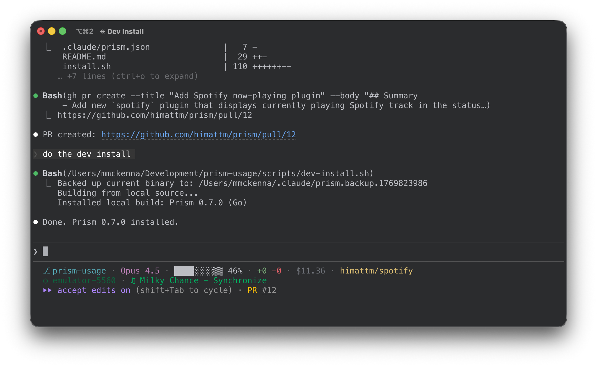

# 💎 Prism

A fast, customizable, and colorful status line for Claude Code.




## Features

- **Fast** - Native Go with parallel plugin execution
- **Actionable context bar** - Shows % until autocompact triggers
- **Rich git info** - Branch, dirty status, upstream tracking (⇣⇡)
- **Mobile dev ready** - Android device info with app version lookup
- **Auto-updates** - Automatically installs updates when Claude is idle
- **Extensible** - Write custom plugins in any language

## Installation

```bash
curl -fsSL https://raw.githubusercontent.com/himattm/prism/main/install.sh | bash
```

Restart Claude Code or start a new session.

## Auto-Update

Prism automatically checks for and installs updates when Claude finishes responding. This is enabled by default.

To disable auto-update:

```json
{
  "plugins": {
    "update": {
      "auto_install": false
    }
  }
}
```

You can also manually update with `prism update` or check for updates with `prism check-update`.

<details>
<summary>Manual installation</summary>

```bash
# Download pre-built binary (macOS/Linux)
curl -fsSL https://github.com/himattm/prism/releases/latest/download/prism-$(uname -s | tr '[:upper:]' '[:lower:]')-$(uname -m | sed 's/x86_64/amd64/;s/aarch64/arm64/') -o ~/.claude/prism
chmod +x ~/.claude/prism

# Or build from source
git clone https://github.com/himattm/prism.git
cd prism && go build -o ~/.claude/prism ./cmd/prism/
```

Add to `~/.claude/settings.json`:

```json
{
  "statusLine": {
    "type": "command",
    "command": "$HOME/.claude/prism"
  },
  "hooks": {
    "UserPromptSubmit": [{"hooks": [
      {"type": "command", "command": "$HOME/.claude/prism hook busy"}
    ]}],
    "Stop": [{"hooks": [
      {"type": "command", "command": "$HOME/.claude/prism hook idle"}
    ]}]
  }
}
```

</details>

## Configuration

Prism uses a 3-tier config system (highest priority first):

| File | Purpose |
|------|---------|
| `.claude/prism.local.json` | Personal overrides (gitignored) |
| `.claude/prism.json` | Repo config (commit for your team) |
| `~/.claude/prism-config.json` | Global defaults |

### Quick Setup

```bash
~/.claude/prism init-global  # Create global defaults
~/.claude/prism init         # Create repo config
```

### Example Config

```json
{
  "icon": "🚀",
  "sections": ["dir", "model", "context", "usage", "git", "android_devices"],
  "autocompactBuffer": 22.5
}
```

### Multi-line Layout

```json
{
  "sections": [
    ["dir", "model", "context", "usage", "git"],
    ["android_devices"]
  ]
}
```

### Options

| Option | Type | Default | Description |
|--------|------|---------|-------------|
| `icon` | string | `"💎"` | Icon before project name |
| `sections` | array | See below | Sections to display |
| `autocompactBuffer` | number | `22.5` | Autocompact buffer % (0 if disabled) |
| `plugins` | object | `{}` | Plugin-specific config |

## Sections

### Built-in

| Section | Description | Example |
|---------|-------------|---------|
| `dir` | Project name + subdirectory | `💎 prism/src` or `💎 ⎇ worktree/src` |
| `model` | Current model | `Opus 4.5` |
| `context` | Context usage bar | `████░░░░▒▒ 56%` |
| `linesChanged` | Uncommitted changes | `+123 -45` |
| `usage` | **Auto-detects billing type** (see below) | `$1.23` or `3h:78% 5d:40%` |

### Usage (Auto-Detect Billing)

The `usage` section automatically detects your billing type and shows the appropriate information:

- **API Billing users**: Shows session cost (e.g., `$1.23`)
- **Max/Pro plan users**: Shows usage limits with countdown (e.g., `3h:78% 5d:40% 4d:25%`)

This replaces the old `cost` section. Simply use `usage` in your sections array - no configuration needed for basic usage.

#### Max/Pro Display Formats

**Text format** (default):
```
4h30m:78% 5d:40% 4d:25%
│         │      └─ Opus weekly: 4 days until reset, 25% used
│         └─ Weekly limit: 5 days until reset, 40% used
└─ Session limit: 4 hours 30 minutes until reset, 78% used
```

**Bars format**:
```
▂█ ▅▃ ▅▂
││ ││ └┴─ Opus: time remaining | usage level
││ └┴─ Weekly: time remaining | usage level
└┴─ Session: time remaining | usage level
```

Colors indicate urgency: white (<70%), yellow (70-89%), red (90%+)

#### Configuration

```json
{
  "usage": {
    "usage_plan": {
      "style": "text",      // "text" or "bars"
      "show_hours": true,   // 5-hour session limit
      "show_minutes": true, // include minutes in hour display (e.g., "4h30m")
      "show_days": true,    // 7-day weekly limit
      "show_opus": true     // Opus-specific weekly limit
    },
    "api_billing": {
      "decimals": 2,        // decimal places for cost
      "color": "gray"       // color from palette
    }
  }
}
```

> **Note:** Three related plugins exist: `usage`, `usage_bars`, and `usage_text`. If multiple are in your sections array, only the **first one listed** will render. Use `usage` for auto-detection, or `usage_bars`/`usage_text` if you're on Max/Pro and want a specific format.

The `dir` section shows `⎇` when you're in a git worktree.

### Context Bar

Shows **actionable** usage - percentage of capacity before autocompact triggers:

```
█████░░░▒▒ 56%

█ used  ░ free  ▒ buffer
```

- **100% = autocompact will trigger**
- Colors: white (<70%), yellow (70-89%), red (90%+)
- Buffer `▒▒` only shows when autocompact is enabled
- Set `"autocompactBuffer": 0` if you disabled autocompact

### Plugins

| Plugin | Description | Example |
|--------|-------------|---------|
| `git` | Branch, dirty, upstream | `main*+2 ⇣3⇡1` |
| `android_devices` | Connected Android devices | `⬡ Pixel 6 (14)` |
| `agent_task_queue` | Build queue status | `tq: ▸ gradlew:build ⧗ 2` |
| `update` | Auto-update + indicator | `⬆` (yellow when update available) |
| `usage` | Auto-detect: cost or plan limits | `$1.23` or `3h:78%` |
| `usage_text` | Max/Pro limits (text only) | `3h:78% 5d:40%` |
| `usage_bars` | Max/Pro limits (bars only) | `▂█ ▅▃ ▅▂` |

### Agent Task Queue

Shows the status of the [agent-task-queue](https://github.com/block/agent-task-queue) build queue in your status line. This prevents multiple expensive builds (gradle, pytest, npm, etc.) from running simultaneously and freezing your system.

**Display format:**
- `tq: ▸ gradlew:build` - Currently running task
- `tq: ▸ pytest ⧗ 2` - Running task with 2 waiting in queue
- `tq: ⚠ 3 waiting (run 'tq clear')` - Error: queue stalled (red text)

**Auto-install:** If `tq` is not found and `uv` is available, the plugin will automatically install [agent-task-queue](https://pypi.org/project/agent-task-queue/) via `uv tool install`.

**Configuration:**
```json
{
  "plugins": {
    "agent_task_queue": {
      "max_command_length": 30,
      "show_queue_count": true
    }
  }
}
```

| Option | Type | Default | Description |
|--------|------|---------|-------------|
| `max_command_length` | number | `30` | Truncate command display at this length |
| `show_queue_count` | bool | `true` | Show waiting task count |

The plugin simplifies gradle commands for readability: `./gradlew :app:assembleDebug` → `gradlew:assembleDebug`

## Contributing Plugins

Plugins are native Go for performance. Community plugins are welcome via PR.

### The Interface

```go
type NativePlugin interface {
    Name() string
    Execute(ctx context.Context, input plugin.Input) (string, error)
    SetCache(c *cache.Cache)
}
```

### Example: Minimal Plugin

```go
// internal/plugins/weather.go
package plugins

import (
    "context"
    "fmt"
    "os/exec"
    "strings"

    "github.com/himattm/prism/internal/cache"
    "github.com/himattm/prism/internal/plugin"
)

type WeatherPlugin struct {
    cache *cache.Cache
}

func (p *WeatherPlugin) Name() string {
    return "weather"
}

func (p *WeatherPlugin) SetCache(c *cache.Cache) {
    p.cache = c
}

func (p *WeatherPlugin) Execute(ctx context.Context, input plugin.Input) (string, error) {
    // Skip expensive work when Claude is busy
    if !input.Prism.IsIdle {
        if p.cache != nil {
            if cached, ok := p.cache.Get("weather"); ok {
                return cached, nil
            }
        }
        return "", nil
    }

    // Get config (with default)
    location := "New York"
    if cfg, ok := input.Config["weather"].(map[string]any); ok {
        if loc, ok := cfg["location"].(string); ok {
            location = loc
        }
    }

    // Fetch weather
    cmd := exec.CommandContext(ctx, "curl", "-sf", fmt.Sprintf("wttr.in/%s?format=%%t", location))
    out, err := cmd.Output()
    if err != nil {
        return "", nil
    }

    // Format with colors
    cyan := input.Colors["cyan"]
    reset := input.Colors["reset"]
    result := fmt.Sprintf("%s%s%s", cyan, strings.TrimSpace(string(out)), reset)

    // Cache for 5 minutes
    if p.cache != nil {
        p.cache.Set("weather", result, 5*time.Minute)
    }

    return result, nil
}
```

### Register Your Plugin

Add to `internal/plugins/interface.go`:

```go
func NewRegistry() *Registry {
    // ...
    r.registerWithCache(&WeatherPlugin{})  // Add this line
    return r
}
```

### Plugin Input

Your `Execute` method receives:

```go
type Input struct {
    Prism   PrismContext           // version, project_dir, session_id, is_idle
    Session SessionContext         // model, context_pct, cost_usd
    Config  map[string]any         // your plugin's config from prism.json
    Colors  map[string]string      // ANSI codes: red, green, yellow, cyan, gray, reset
}
```

### Best Practices

1. **Check `IsIdle`** - Only do expensive work when Claude is waiting for input
2. **Use the cache** - Avoid redundant work with `p.cache.Get/Set`
3. **Use provided colors** - `input.Colors["cyan"]` for consistency
4. **Return empty string to hide** - Don't show section if nothing to display
5. **Respect context** - Use `ctx` for timeouts, honor cancellation

### Hooks (Optional)

Plugins can react to Claude Code events by implementing the optional `Hookable` interface:

```go
type Hookable interface {
    OnHook(ctx context.Context, hookType HookType, hookCtx HookContext) (string, error)
}
```

**Available Hook Types:**

| Hook | CLI Command | Claude Code Event | Use Case |
|------|-------------|-------------------|----------|
| `HookSessionStart` | `prism hook session-start` | SessionStart | Initialize, load context |
| `HookSessionEnd` | `prism hook session-end` | SessionEnd | Cleanup, save state |
| `HookBusy` | `prism hook busy` | UserPromptSubmit | Notifications, state reset |
| `HookIdle` | `prism hook idle` | Stop | Cache refresh, cleanup |
| `HookNotification` | `prism hook notification` | Notification | React to notifications |
| `HookPermissionRequest` | `prism hook permission-request` | PermissionRequest | Permission dialog shown |
| `HookPreToolUse` | `prism hook pre-tool-use` | PreToolUse | Before tool calls |
| `HookPostToolUse` | `prism hook post-tool-use` | PostToolUse | After tool calls complete |
| `HookSubagentStop` | `prism hook subagent-stop` | SubagentStop | Subagent task completed |
| `HookPreCompact` | `prism hook pre-compact` | PreCompact | Warn user, save important data |
| `HookSetup` | `prism hook setup` | Setup | Repo initialization (--init, --maintenance) |

**Example: Cache Invalidation on Idle**

```go
func (p *MyPlugin) OnHook(ctx context.Context, hookType HookType, hookCtx HookContext) (string, error) {
    if hookType == HookIdle {
        // Invalidate cache when Claude becomes idle
        p.cache.Delete("my-cache-key")
    }
    return "", nil
}
```

**Example: Notification on Busy**

```go
func (p *MyPlugin) OnHook(ctx context.Context, hookType HookType, hookCtx HookContext) (string, error) {
    if hookType == HookBusy {
        if shouldNotify() {
            // Return string to display as notification
            return "\033[36mHey!\033[0m Something happened.", nil
        }
    }
    return "", nil
}
```

**HookContext:**
```go
type HookContext struct {
    SessionID string  // Current session ID
    AgentType string  // Agent type if --agent was specified (e.g., "coder", "researcher")
}
```

**Async vs Sync Hooks (Claude Code v2.1.0+):**

Hooks can run synchronously (Claude waits) or asynchronously (fire-and-forget). Prism uses async for hooks that don't need to display output or block execution:

| Hook | Mode | Rationale |
|------|------|-----------|
| `UserPromptSubmit` | **sync** | UpdatePlugin shows notifications here |
| `Stop` | **async** | Cache invalidation, no output needed |
| `SessionStart` | **async** | Fast init, fire-and-forget |
| `SessionEnd` | **async** | Cleanup, fire-and-forget |
| `PreCompact` | **sync** | May warn user before compaction |
| `Setup` | **sync** | May output setup status |
| `PreToolUse` | **sync** | Can block tool execution |
| `PostToolUse` | **async** | Logging only |
| `PermissionRequest` | **sync** | May display info |
| `Notification` | **async** | Logging only |
| `SubagentStop` | **async** | Logging only |

**Full settings.json with all hooks:**
```json
{
  "hooks": {
    "UserPromptSubmit": [{"hooks": [{"type": "command", "command": "$HOME/.claude/prism hook busy"}]}],
    "Stop": [{"hooks": [{"type": "command", "command": "$HOME/.claude/prism hook idle", "async": true}]}],
    "SessionStart": [{"hooks": [{"type": "command", "command": "$HOME/.claude/prism hook session-start", "async": true}]}],
    "SessionEnd": [{"hooks": [{"type": "command", "command": "$HOME/.claude/prism hook session-end", "async": true}]}],
    "Notification": [{"hooks": [{"type": "command", "command": "$HOME/.claude/prism hook notification", "async": true}]}],
    "PermissionRequest": [{"hooks": [{"type": "command", "command": "$HOME/.claude/prism hook permission-request"}]}],
    "PreToolUse": [{"hooks": [{"type": "command", "command": "$HOME/.claude/prism hook pre-tool-use"}]}],
    "PostToolUse": [{"hooks": [{"type": "command", "command": "$HOME/.claude/prism hook post-tool-use", "async": true}]}],
    "SubagentStop": [{"hooks": [{"type": "command", "command": "$HOME/.claude/prism hook subagent-stop", "async": true}]}],
    "PreCompact": [{"hooks": [{"type": "command", "command": "$HOME/.claude/prism hook pre-compact"}]}],
    "Setup": [{"hooks": [{"type": "command", "command": "$HOME/.claude/prism hook setup"}]}]
  }
}
```

Hooks are optional - plugins that don't implement `Hookable` work exactly as before.

### Submit Your PR

1. Fork the repo
2. Add `internal/plugins/yourplugin.go`
3. Register in `NewRegistry()`
4. Add tests in `internal/plugins/yourplugin_test.go`
5. Update README plugins table
6. Submit PR

## Script Plugins (Personal Use)

For quick personal plugins, you can use scripts instead:

```bash
# ~/.claude/prism-plugins/prism-plugin-myplugin.sh
#!/bin/bash
INPUT=$(cat)
CYAN=$(echo "$INPUT" | jq -r '.colors.cyan')
RESET=$(echo "$INPUT" | jq -r '.colors.reset')
echo -e "${CYAN}hello${RESET}"
```

Script plugins receive JSON on stdin with the same structure as native plugins.

## Development

```bash
go build -o prism-go ./cmd/prism/
go test ./...
```

## License

MIT
